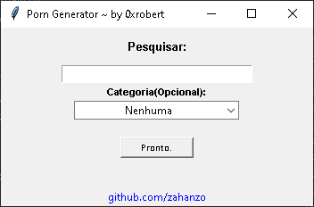
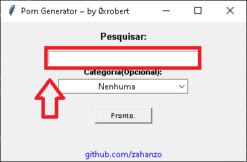
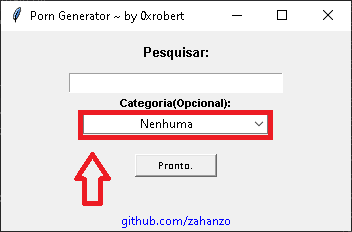
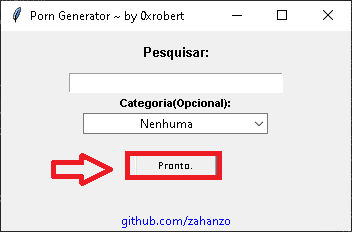

# Porn Generator




> Cansado de procurar video? quer automatizar esse processo e ser feliz com um video escolhido pelo destino? Sim?! Então, esse é o script certo pra você!

### Ajustes e melhorias

O projeto ainda está em desenvolvimento e as próximas atualizações serão voltadas nas seguintes tarefas:

- [x] Adicionar Pornhub
- [ ] Adicionar todas categorias do Pornhub
- [ ] Adicionar Xvideos
- [ ] Adicionar todas categorias do Xvideos
- [ ] Adicionar Xhamster
- [ ] Adicionar todas categorias do Xhamster

## 💻 Pré-requisitos

Antes de começar, verifique se você atendeu aos seguintes requisitos:

* Você instalou a versão mais recente de `Python`
[Python](https://www.python.org/downloads/)

## 🚀 Instalando Porn Generator

Para instalar o Porn Generator, siga estas etapas:

Linux, macOS e Windows:

Navegue até a pasta do repositório e execute:
```
pip install -r requirements.txt
```

## ☕ Usando Porn Generator

Para usar Porn Generator, basta executa-lo da seguinte maneira:

```
python main.py
```

Após executar o script, está tela será aberta:


Para procurar pálavras-chaves, utilize o campo de pesquisa:


Para escolher por categorias, utilize a caixa:


E por fim, quando estiver terminado, clique no botão, e sera aberto um video aleatorio no seu navegador:


## 📫 Contribuindo para Porn Generator

Para contribuir com Porn Generator, siga estas etapas:

1. Bifurque este repositório.
2. Crie um branch: `git checkout -b <nome_branch>`.
3. Faça suas alterações e confirme-as: `git commit -m '<mensagem_commit>'`
4. Envie para o branch original: `git push origin <nome_do_projeto> / <local>`
5. Crie a solicitação de pull.

Como alternativa, consulte a documentação do GitHub em [como criar uma solicitação pull](https://help.github.com/en/github/collaborating-with-issues-and-pull-requests/creating-a-pull-request).

## 😄 Seja um dos contribuidores

Quer fazer parte desse projeto? Clique [AQUI](CONTRIBUTING.md) e leia como contribuir.

## 📝 Licença

Esse projeto está sob licença. Veja o arquivo [LICENÇA](LICENSE.md) para mais detalhes.